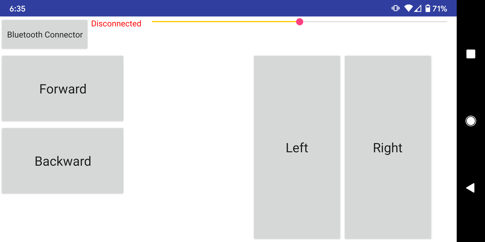

# User Documentation

## General Information

Welcome to group F.11's Control App User Documentation. This short guide will give you the information required to both utilize and/or grade this RCV control app! 

The basic setup of this project consists mostly of two major files. The Control App itself is built up of 

1. An android application package (**.apk**). This file installs the app onto your android mobile device, and,
2. An arduino **sketch** (.ino). This file is installed onto an arduino microprocessor (an Arduino Uno for our project) and runs commands on the vehicle itself to recieve input from the app mentioned above. 

So, in short you need to download these two files and put them in their right places for it to work, which is detailed below!

## Installation

If you're reading this Readme then you have probably already cloned/downloaded the .zip from the online Repository. If you haven't done so, you can find the repository [here](https://github.com/Risauce/Egen310ControlApp). Just simply hit the *Clone or Download* button and select *download Zip*. 

The next step is placing the pieces of software exactly where they need to go. If you have an Arduino Uno, you simply have to use the Online Arduino Create (or the Arduino IDE) to install the sketch into your machine. 

The APK is just as easy to install, simply transfer the file to your android mobile device (or an emulator if you'd like) and run the file. If prompted to change developmental settings on your device, you may need to make those changes before running the APK. 

## Using the Software

Thankfully you don't have to worry about directly using the Arduino code, the Android application does that for you! I tried to make the control app as self-explanatory as possible, and it follows the same basic idea of most two stick controllers. Here is a screenshot of prototype 1's user interface:

Prototype 1: 

Prototype 1 definitely focused on keeping the design simple and easy to understand. The first step to using this app is taken outside of it however, as you must first pair your android mobile device to the vehicle before you can use the *bluetooth connector* in the app. 

- The password is usually 1234 to connect, but can be 0000. 

Clicking on the *bluetooth connector* will promp you to connect to already paired bluetooth devices, and once your android mobile device is connected to the vehicle, it will bring you back to this UI page and the *Disconnected* will change to a *Connected*. 

From here you can begin to use the different parts of the app, controlling the vehicle in the process! The sliding bar to the right of the connected determines the vehicle's speed, in by how much power is sent to the motors on your command.  

## Report a Bug

The simplest way to report a bug is to navigate to the *issues* page of the github repository, located [here](https://github.com/Risauce/Egen310ControlApp/issues), and file an issue. 

When time allows I may implement a function within-app to file a bug/complaint. 